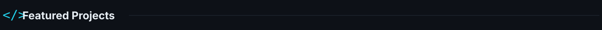
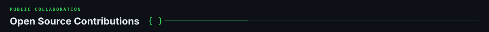
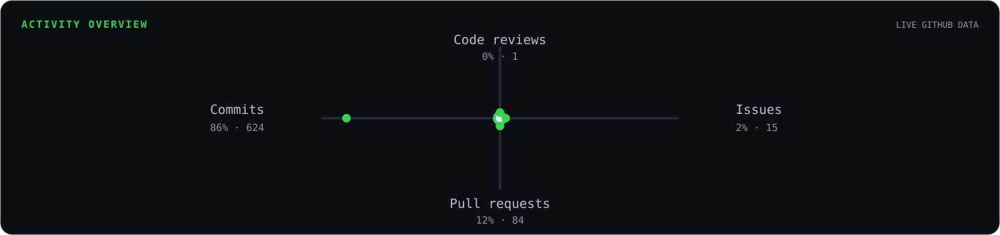

<!-- AUTO-GENERATED by scripts/generate_profile.py. Edit profile.config.json instead. -->

  

  
  
  
  
  

  

<!-- Project names are generated from profile.config.json into replaceable badge URLs, never local SVGs. -->

   
  Real-time multiplayer drawing with a Go WebSocket backend. 
  ★ 1 · Fork 1

   
  Fast uptime monitoring with workers, alerts and incident history. 
  ★ 1 · Fork 0

   
  A C++ DSL compiler and VM for interactive text adventures. 
  ★ 1 · Fork 0

<!-- OSS names are generated from profile.config.json into replaceable badge URLs, never local SVGs. -->

  &nbsp;
  &nbsp;
  

Each badge opens the pull requests authored in that upstream repository.

  

  

