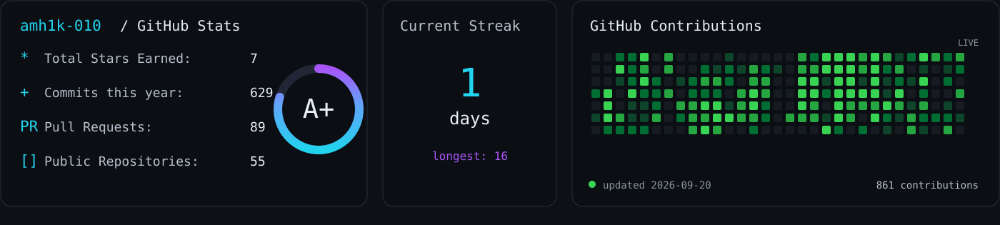

<!--
  AUTHOR-OWNED PROFILE README
  The scheduled workflow preserves this document and only refreshes the
  PROFILE_DYNAMIC block below. Edit this file freely.
-->

  

  
  
  
  
  

  

## Featured Projects

| Project | Stack | Description |
| --- | --- | --- |
| **[Mithril Tiles](https://github.com/amh1k/mithril-tiles)** | Go · WebSockets · PostgreSQL · React · TypeScript | Server-authoritative real-time drawing game with concurrent room event loops, reconnect-safe canvas state, authentication, scoring, timers, and automated tests. |
| **[Keepalive Monitoring](https://github.com/amh1k/keepalive-monitoring)** | Node.js · TypeScript · PostgreSQL · Redis · BullMQ · React | Uptime and incident-monitoring platform with background workers, failure thresholds, latency tracking, SSL checks, alerts, and production deployment behind Nginx. |
| **[Durin's Code](https://github.com/amh1k/DurinsCode)** | C++17 · WebAssembly · TypeScript | DSL compiler and virtual machine for interactive text adventures: lexer, recursive-descent parser, semantic analysis, TAC optimization, bytecode generation, and browser IDE. |

## Open Source Contributions

I contribute primarily to **backend systems, Kubernetes, cloud-native infrastructure, and developer tooling**, with ongoing work across the **OpenEverest ecosystem**, Alibaba OpenCodeReview, Kubeflow, Apache, and KubeStellar.

<!-- PROFILE_DYNAMIC:START -->

<strong>25 PRs</strong> · <strong>17 merged</strong> · <strong>8 open</strong> · live GitHub data 
Open Code Review: 16 PRs / 11 merged · KubeStellar: 2 PRs / 2 merged · Apache Magpie: 2 PRs / 2 merged · OpenEverest: 3 PRs / 2 merged · Kubeflow SDK: 2 PRs / 0 merged

<!-- PROFILE_DYNAMIC:END -->

| Project                            | Pull Request                                                                                                                                                                      | Status          | Engineering Impact                                                                                                                                                                                                                                        |
| ---------------------------------- | --------------------------------------------------------------------------------------------------------------------------------------------------------------------------------- | --------------- | --------------------------------------------------------------------------------------------------------------------------------------------------------------------------------------------------------------------------------------------------------- |
| **OpenEverest · MariaDB Provider** | [Enable TLS transport encryption (#46)](https://github.com/openeverest/provider-mariadb/pull/46)                                                                                  | **Open**        | Implements end-to-end TLS support for standalone and Galera deployments, including provider-to-operator configuration mapping, certificate preservation, CA publication in connection secrets, validation, UI controls, and unit/integration coverage.    |
| **OpenEverest · CNCF**             | [Spaced repository path support (#2790)](https://github.com/openeverest/openeverest/pull/2790) · [release-2.0 port (#2812)](https://github.com/openeverest/openeverest/pull/2812) | **Merged**      | Fixed the Kubernetes development workflow across Make, Tilt, Helm, controller-generation, and frontend build paths when OpenEverest is checked out under directories containing spaces; adapted the fix independently for the diverged v2 release branch. |
| **OpenEverest · CNCF**             | [Add typed backup and restore state enums (#2933)](https://github.com/openeverest/openeverest/pull/2933)                                                                          | **Open**        | Strengthens the v2 API contract by adding CRD enum validation and propagating typed backup/restore states through generated OpenAPI schemas, Go clients, CLI code, and TypeScript UI/API-test types.                                                      |
| **Alibaba OpenCodeReview**         | [Refactor CLI validation using Cobra (#694)](https://github.com/alibaba/open-code-review/pull/694)                                                                                | **Merged**      | Moved parent-command validation into Cobra's command lifecycle, reducing custom argument handling and making CLI behavior more consistent.                                                                                                                |
| **Alibaba OpenCodeReview**         | [Strip Git index headers from review prompts (#609)](https://github.com/alibaba/open-code-review/pull/609)                                                                        | **Merged**      | Improved the review pipeline by removing irrelevant Git index metadata before diffs are passed into LLM review prompts.                                                                                                                                   |
| **Alibaba OpenCodeReview**         | [Add binary smoke testing to CI (#566)](https://github.com/alibaba/open-code-review/pull/566)                                                                                     | **Merged**      | Extended CI beyond unit tests by building and executing the distributed CLI binary to catch packaging and startup regressions.                                                                                                                            |
| **Kubeflow SDK · CNCF**            | [Spark Connect default service-account fallback (#672)](https://github.com/kubeflow/sdk/pull/672)                                                                                 | **Open · LGTM** | Adds Kubernetes service-account fallback behavior for Spark Connect deployments and accompanying test coverage, simplifying SDK usage with default Spark Operator installations.                                                                          |
| **Apache Magpie**                  | [Narrow SourceHut exception handlers (#988)](https://github.com/apache/magpie/pull/988)                                                                                           | **Merged**      | Tightened integration-layer exception handling so unexpected failures propagate correctly instead of being silently swallowed.                                                                                                                            |

More upstream work:
<a href="https://github.com/openeverest/openeverest/pulls?q=is%3Apr+author%3Aamh1k">OpenEverest Core</a> ·
<a href="https://github.com/openeverest/provider-mariadb/pulls?q=is%3Apr+author%3Aamh1k">OpenEverest MariaDB Provider</a> ·
<a href="https://github.com/openeverest/everest-doc/pulls?q=is%3Apr+author%3Aamh1k">OpenEverest Docs</a> ·
<a href="https://github.com/alibaba/open-code-review/pulls?q=is%3Apr+author%3Aamh1k">Alibaba OpenCodeReview</a> ·
<a href="https://github.com/kubeflow/sdk/pulls?q=is%3Apr+author%3Aamh1k">Kubeflow SDK</a> ·
<a href="https://github.com/apache/magpie/pulls?q=is%3Apr+author%3Aamh1k">Apache Magpie</a> ·
<a href="https://github.com/kubestellar/console/pulls?q=is%3Apr+author%3Aamh1k">KubeStellar</a>

---

  Backend engineering · Go · Kubernetes · Distributed systems · Open source

