<!--
  MINIMAL PROFILE README
  Reusable design: project and OSS names are NOT embedded in the custom SVGs.
  Search for "EDIT:" below to update content without regenerating any asset.
-->

  

<!-- EDIT: social/profile links -->

  &nbsp;
  &nbsp;
  &nbsp;
  &nbsp;
  

  Building reliable software beyond the happy path — from service and data layers to the interfaces that make them useful.

<h2 align="center">Featured projects</h2>

<!--
  EDIT: PROJECTS
  For each card, change BOTH:
  1. href="https://github.com/OWNER/REPO"
  2. username=OWNER&repo=REPO inside src
  The cards pull repository data automatically; no local SVG regeneration is needed.
-->

  
  
  

<h2 align="center">Open source</h2>

<!--
  EDIT: OSS
  Names and destinations live only in this README. These links open your PRs
  in each upstream repository, so the section stays honest and verifiable.
-->

  &nbsp;
  &nbsp;
  

<h2 align="center">Contribution rhythm</h2>

<!-- EDIT: replace amh1k in username= and the destination link when reusing -->

  

<!-- EDIT: keep the stack to one compact row -->

  

<code>code → review → learn → repeat</code>

