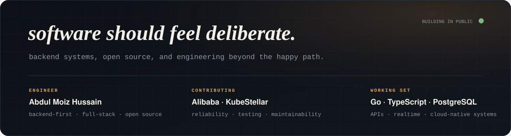
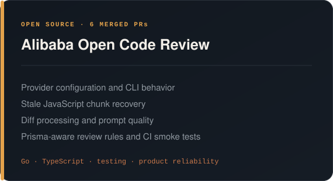
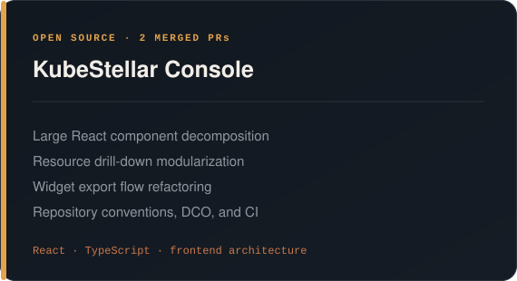

  

  <a href="https://abdulmoizhussain.me">portfolio</a>
  &nbsp;·&nbsp;
  <a href="https://www.linkedin.com/in/abdulmoizhussain">linkedin</a>
  &nbsp;·&nbsp;
  <a href="mailto:abdulmoizx97@gmail.com">email</a>
  &nbsp;·&nbsp;
  <a href="https://leetcode.com/u/abdulmoizx97/">leetcode</a>
  &nbsp;·&nbsp;
  <a href="https://codeforces.com/profile/amh1k">codeforces</a>

 

Open-source work

  
  

Also contributed to: Apache Magpie · Observal · Kubeflow SDK · OpenSRE

 

Contribution rhythm

  

