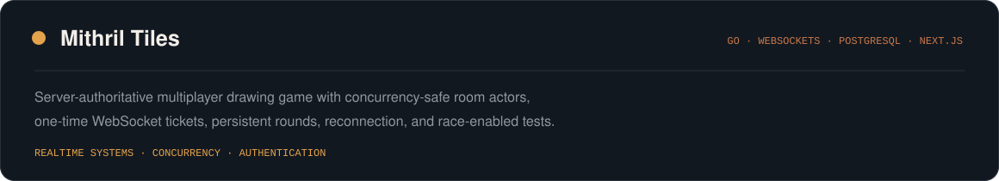
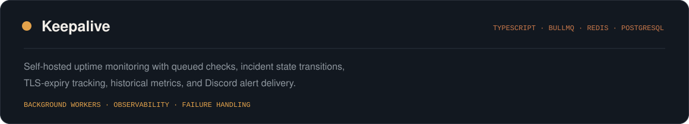
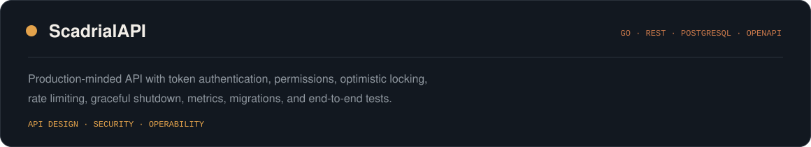
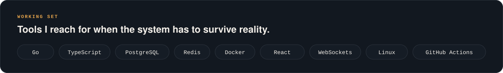
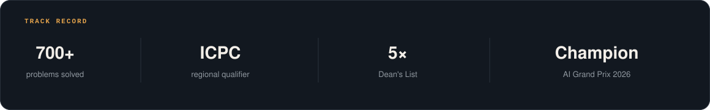

  

  <a href="https://abdulmoizhussain.me">portfolio</a>
  &nbsp;·&nbsp;
  <a href="https://www.linkedin.com/in/abdulmoizhussain">linkedin</a>
  &nbsp;·&nbsp;
  <a href="mailto:abdulmoizx97@gmail.com">email</a>
  &nbsp;·&nbsp;
  <a href="https://leetcode.com/u/abdulmoizx97/">leetcode</a>
  &nbsp;·&nbsp;
  <a href="https://codeforces.com/profile/amh1k">codeforces</a>

 

## Open-source work

  
  

**Also contributed to:** [Apache Magpie](https://github.com/apache/magpie/pulls?q=is%3Apr+author%3Aamh1k) · [Observal](https://github.com/Observal/observal/pulls?q=is%3Apr+author%3Aamh1k) · [Kubeflow SDK](https://github.com/kubeflow/sdk/pulls?q=is%3Apr+author%3Aamh1k) · [OpenSRE](https://github.com/Tracer-Cloud/opensre/pulls?q=is%3Apr+author%3Aamh1k)

 

## Contribution rhythm

  

 

## Selected systems

  

  

  

 

## More engineering work

### [Algorithmic Analysis and Visualization](https://github.com/amh1k/Daa-Project)

Thirteen-plus divide-and-conquer algorithms in C++, an interactive recursion visualizer, and automated benchmarking across large generated datasets.

### [Durin’s Code](https://github.com/amh1k/DurinsCode)

A C++ language implementation with lexical analysis, recursive-descent parsing, semantic validation, JSON bytecode, and a stack-based virtual machine.

 

## Working set

  

 

## Competitive and academic record

  

- **3rd place**, Coders Cup 2025.
- **4th place**, AI Got Talent at DevDay 2026, with an F1 score of `0.986`.
- Solved **700+ algorithmic problems** across Codeforces, LeetCode, and AtCoder.

 

---

  <strong>building beyond the happy path.</strong> 
  
    Interested in backend engineering, cloud-native tooling, reliable APIs,
    real-time systems, and production-minded infrastructure.
  

