<!-- AUTO-GENERATED by scripts/generate_profile.py. Edit profile.config.json instead. -->

  

  
  <a href="https://www.linkedin.com/in/abdulmoizhussain">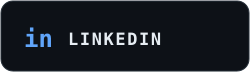</a>
  
  
  

  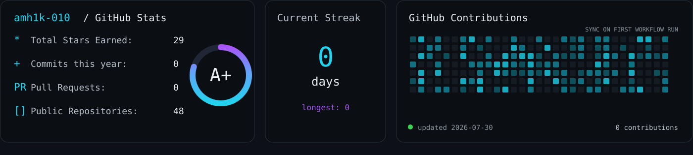

  <a href="https://github.com/amh1k/mithril-tiles">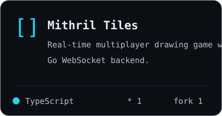</a>
  <a href="https://github.com/amh1k/keepalive-monitoring">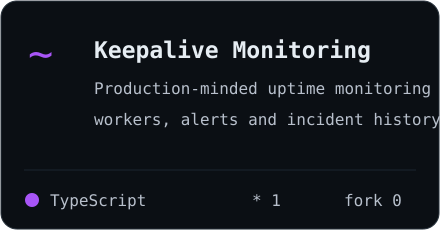</a>
  <a href="https://github.com/amh1k/DurinsCode">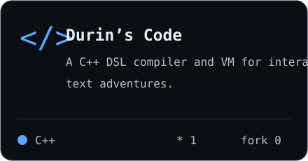</a>

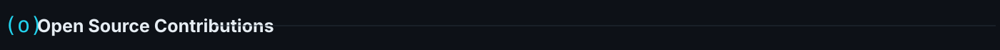

  <a href="https://github.com/alibaba/open-code-review/pulls?q=is%3Apr+author%3Aamh1k">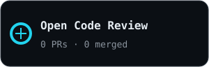</a>
  <a href="https://github.com/kubestellar/console/pulls?q=is%3Apr+author%3Aamh1k">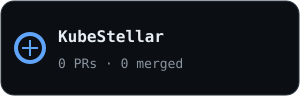</a>
  <a href="https://github.com/apache/magpie/pulls?q=is%3Apr+author%3Aamh1k">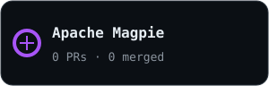</a>
  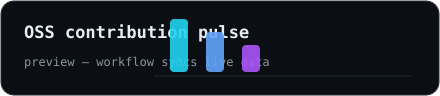

  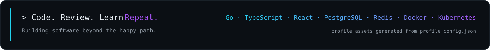

