<!--
  PROFILE README — styled to resemble the approved dark dashboard concept.
  Project cards and OSS repository listings are generic/editable here in README.md.
  You do NOT need to regenerate SVG assets to swap project or OSS repo names.
-->

  

  
  
  
  
  

<table width="100%">
  <tr>
    <td width="38%" valign="top">
      
    </td>
    <td width="24%" valign="top">
      
    </td>
    <td width="38%" valign="top">
      
    </td>
  </tr>
</table>

 

##  Featured Projects

<!--
EDIT: FEATURED PROJECTS
For each project card, you can replace both:
1) href="https://github.com/OWNER/REPO"
2) username=OWNER&repo=REPO inside the image src
No SVG regeneration needed.
-->

  
  
  

 

##  Open Source Contributions

<!--
EDIT: OSS REPOSITORY LISTINGS
Replace the labels and links only in the README.
Current links point to PR searches authored by amh1k.
-->
<table width="100%">
  <tr>
    <td width="54%" valign="top">
      

        
        
        
      

      <ul>
        <li><b>Open Code Review</b> — reviews, CI, tooling, or quality-of-life fixes.</li>
        <li><b>KubeStellar</b> — cloud-native and multi-cluster contribution work.</li>
        <li><b>Apache</b> — upstream learning through practical contributions.</li>
      </ul>
    </td>
    <td width="46%" valign="top">
      
    </td>
  </tr>
</table>

<!--
EDIT: OSS GRAPH
This is intentionally separate from the repo list, so you can keep the same look
while swapping the repos above at any time.
-->

  

  

Profile README • updated from live GitHub widgets where available

